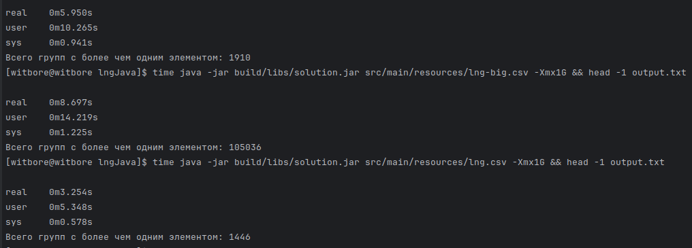

# README
## Ответ

## Запуск решения
1. `./gradlew shadowJar`
2. `java -jar build/libs/solution.jar src/main/resources/lng-4.txt -Xmx1G`
3. `java -jar build/libs/solution.jar src/main/resources/lng-big.csv -Xmx1G`
4. `java -jar build/libs/solution.jar src/main/resources/lng.csv -Xmx1G`

## Алгоритм работы
Задача: [lng-java.md](docs/lng-java.md)
1. Производим чтение строк из файла.
2. Каждая строка парится на наличие в ней корректных чисел. Некорректные строки отбрасываются
3. Для каждого числа сохраняется временная запись вида `колонка;число|номер_строки` во временном .tmp файле.
4. После завершения чтения строится индекс: строковое значение `колонка;число` к строкам, где оно встречается. Для экономии памяти строки-ключи кэшируются. 
5. Каждая строка добавляется в Union-Find как отдельное множество.
6. Для каждого ключа `колонка;число` в индексе объединяются все строки, в которых он встречается.
7. Для каждой строки определяется корневой элемент её множества, после чего строки группируются по этому корню. 
8. Фильтруем группы с менее чем 2 элементами, сортируем.
9. Строки восстанавливаются из memory-mapped входного файла по смещению и записываются.
